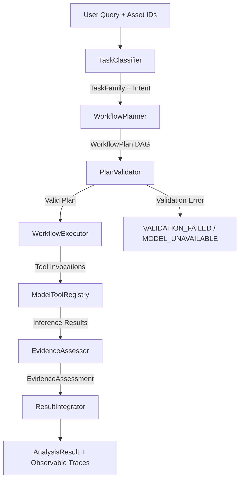

# SatQuery AI - Agent Architecture Specification

**Problem Statement:** ISRO / SatQuery AI - SatQuery AI Specification  
**System:** SatQuery AI Bounded Agentic Workflow Controller  
**Document Version:** 1.0 (Prompt 4 of 8)

---

## 1. Executive Summary

SatQuery AI employs a **bounded, registry-driven agentic workflow controller** designed specifically for high-assurance remote-sensing analysis. In contrast to unconstrained autonomous agents that generate arbitrary code, hallucinate tool calls, or loop indefinitely, SatQuery AI enforces:
1. **Deterministic & Bounded Planning**: Tasks are classified based on multimodal inputs (image count, sensor modalities, spatial bounds) and query semantics into strict `TaskFamily` targets.
2. **Capability-Validated Tool Registry**: All specialists (adapters) must register explicit capability metadata (`supported_tasks`, `supported_modalities`, `input_schema`, `output_schema`, `permitted_parameters`, `availability`, and `resource_requirements`). Unimplemented or un-adapted models are registered as unavailable (`availability="UNAVAILABLE"`).
3. **Server-Side Plan Validation**: Plans are expressed as typed Directed Acyclic Graphs (DAGs) and validated against asset records, spatial compatibility, modality support, parameter bounds, and cyclic dependencies before any model execution begins.
4. **Hardware-Aware Sequential Execution**: Designed for resource-constrained hosts (e.g., Apple Silicon M-series with 8 GB unified RAM), the execution engine actively unloads competing heavy vision models to prevent OOM termination.
5. **Evidence-Grounded Assessment Gate**: Model outputs are never blindly accepted as confirmed truth. Bounding box detections are subjected to non-maximum suppression (IoU 0.60), geometric sanity filtering (eliminating scene-dominating degenerate boxes $\ge 85\%$ and micro-noise $<0.03\%$), and raw logit score categorization. Confidence is kept uncalibrated and nullable; weak activations are explicitly reported with limitations and warnings rather than fabricated probabilities.
6. **Observable Execution Traces**: Every analysis returns an un-obfuscated execution trace of steps executed, durations, tools invoked, parameters passed, and evidence verdicts, without exposing hidden chain-of-thought or raw deliberations.

---

## 2. Component Architecture

The orchestration subsystem is located at `backend/app/services/orchestration/` and comprises the following modular services:

```
backend/app/services/orchestration/
├── __init__.py               # Public orchestration symbols
├── controller.py             # WorkflowController: Main lifecycle orchestrator
├── task_classifier.py        # Intent and multimodal input classifier
├── planner.py                # WorkflowPlanner: DAG plan construction
├── plan_schema.py            # Typed Pydantic schemas (WorkflowPlan, PlanStep, EvidenceAssessment)
├── plan_validator.py         # PlanValidator: Pre-execution safety and compatibility checks
├── executor.py               # WorkflowExecutor: Dependency-aware step execution & memory management
├── evidence_assessor.py      # EvidenceAssessor: NMS, geometry validation, score gating
└── result_integrator.py      # ResultIntegrator: Synthesis into AnalysisResult
```

### Flow Diagram



---

## 3. Planning Schema & Safety

### 3.1 `WorkflowPlan` Schema
Plans are typed Pydantic models with strict validation:
- `plan_id`: Unique identifier (`plan_<uuid>`).
- `task_family`: Target `TaskFamily` enum value (`SINGLE_VQA`, `SINGLE_GROUNDING`, `SINGLE_CAPTION`, `TEMPORAL_CHANGE`, `TEMPORAL_CHANGE_VQA`, `OPTICAL_SAR_ANALYSIS`).
- `input_asset_ids`: List of verified asset UUIDs.
- `steps`: Ordered list of `PlanStep` definitions.
- `dependencies`: Step dependency mapping (`step_id -> [predecessor_ids]`).
- `permitted_parameters`: Bounded dictionary of execution parameters (e.g. `box_threshold`, `text_threshold`).
- `expected_outputs`: Expected output keys (e.g. `answer`, `detections`, `evidence_assessment`).
- `validation_status`: `"pending"`, `"valid"`, or `"rejected"`.

### 3.2 Anti-Hallucination & Code Execution Safeguards
- **No Arbitrary Code Execution**: The controller executes only predefined, registered Python adapters implementing `BaseModelAdapter`.
- **No Invented Tools**: Every tool identifier must resolve in `model_tool_registry.get_tool(tool_id)`.
- **LLM Boundary**: If an LLM is configured for natural language query interpretation, its output is strictly constrained to a JSON schema selecting from pre-registered tool IDs and bounded parameters. If the LLM response violates schema constraints, fails to parse, or invents tools, the system rejects the output and falls back to deterministic rule-based classification.

---

## 4. Tool Capability Registry

`ModelToolRegistry` maintains capability metadata for each tool:

| Tool ID | Model Checkpoint | Modalities | Tasks | Availability | Notes |
|---|---|---|---|---|---|
| `blip_vqa_adapter` | `Salesforce/blip-vqa-base` | OPTICAL, MULTISPECTRAL | SINGLE_VQA, SINGLE_CAPTION | AVAILABLE | Generic VQA baseline; RS fine-tuning pending |
| `owlvit_grounding_adapter` | `google/owlvit-base-patch32` | OPTICAL, MULTISPECTRAL | SINGLE_GROUNDING | AVAILABLE | Open-vocabulary detector; raw logits uncalibrated |
| `temporal_change_adapter` | Placeholder | OPTICAL, MULTISPECTRAL | TEMPORAL_CHANGE, TEMPORAL_CHANGE_VQA | UNAVAILABLE | Reserved for Prompt 5; requests explicitly fail |
| `optical_sar_fusion_adapter`| Placeholder | OPTICAL + SAR | OPTICAL_SAR_ANALYSIS | UNAVAILABLE | Reserved for Prompt 6; requests explicitly fail |

---

## 5. Execution Engine & Host Memory Protection

On hardware platforms with shared unified memory (e.g., Apple Silicon M-series with 8 GB RAM), concurrently loading multiple multi-hundred-megabyte vision-language transformers (BLIP + OWL-ViT) risks memory pressure and swap thrashing.

`WorkflowExecutor` enforces:
1. **Lazy Loading**: Models are instantiated only when their specific step is executed.
2. **Mutual Exclusion Memory Management**: Before loading `google/owlvit-base-patch32`, any loaded `Salesforce/blip-vqa-base` weights are unloaded and garbage-collected (with `torch.mps.empty_cache()` or `torch.cuda.empty_cache()` invoked). The reverse occurs before VQA execution.
3. **Execution Timeout**: Steps enforce configurable timeouts (default 45s) to guard against hung processes.
4. **Step-Level Observability**: Start time, end time, duration, tool identifier, and step status (`SUCCESS`, `FAILED`) are captured in each `ExecutionStep`.

---

## 6. Evidence Assessment & Quality Safeguards

The `EvidenceAssessor` implements strict scientific integrity gates:

### 6.1 Raw Detector Scores & Confidence
- OWL-ViT outputs raw sigmoid logit activations. They are **not** probabilities.
- Confidence is kept `None` (nullable) or explicitly labeled as uncalibrated.
- dScores $< 0.05$ are classified as `WEAK` evidence with low reliability. Scores $\ge 0.15$ are classified as `SUPPORTED`. Scores in between are flagged for analyst review.

### 6.2 Geometric Sanity Filtering
- **Scene-Dominating Boxes**: Bounding boxes occupying $\ge 85\%$ of the total image area are flagged as degenerate full-image false alarms and excluded from final evidence.
- **Micro-Noise**: Boxes smaller than $0.03\%$ of scene area are excluded as point artifacts.
- **Non-Maximum Suppression (NMS)**: Redundant overlapping detections are pruned using an IoU threshold of $0.60$.

### 6.3 Evidence Status Categories
- `SUPPORTED`: Valid detections pass geometric checks and minimum score thresholds.
- `WEAK`: Detections exist but scores are low ($<0.05$) or feature overlaps suggest ambiguous localization.
- `INSUFFICIENT`: No detections pass filtering, or VQA answer is entirely unsupported by visual evidence.
- `UNAVAILABLE`: Specialist model for the requested modality or task family is not implemented.
- `CONFLICTING`: Future multi-sensor or bi-temporal disagreement.

---

## 7. Failure Handling & Explicit States

SatQuery AI never reports synthetic success when a model or validation fails:

| Failure Condition | Status Code | Analysis Status | Response Payload |
|---|---|---|---|
| Non-existent Image Asset ID | 404 | N/A | `{"detail": "Asset not found: ..."}` |
| SAR image passed to Optical-only model | 200 | `MODEL_UNAVAILABLE` | Explicit explanation that optical models cannot process SAR |
| Temporal analysis requested | 200 | `MODEL_UNAVAILABLE` | Explains temporal change detection models are not yet deployed |
| Optical+SAR fusion requested | 200 | `MODEL_UNAVAILABLE` | Explains cross-modal fusion pipeline is not yet deployed |
| Disjoint spatial extents in future pairs | 200 | `VALIDATION_FAILED` | Overlap check failure explanation |
| Grounding detections below threshold | 200 | `COMPLETED_WITH_WARNINGS` or `INSUFFICIENT_EVIDENCE` | Detections empty or weak, limitations clearly listed |
| Specialist runtime exception | 200 | `FAILED` | Error propagated in `warnings` and `execution_summary` |

---

## 8. Preserved Frontend Integration

The user flow remains seamless:
1. User uploads imagery (GeoTIFF, TIFF, or benchmark PNG).
2. User submits a natural language question (e.g., "What is the dominant land cover?", "Locate the water body", "What changed between these images?").
3. The frontend passes `query` and `image_ids` to `POST /api/analysis`.
4. The controller autonomously classifies the intent, designs the workflow plan, validates dependencies, executes tools, assesses evidence, and returns the grounded result.
5. The frontend displays the observable trace, evidence overlays, warnings, and limitations without requiring manual model selection.
