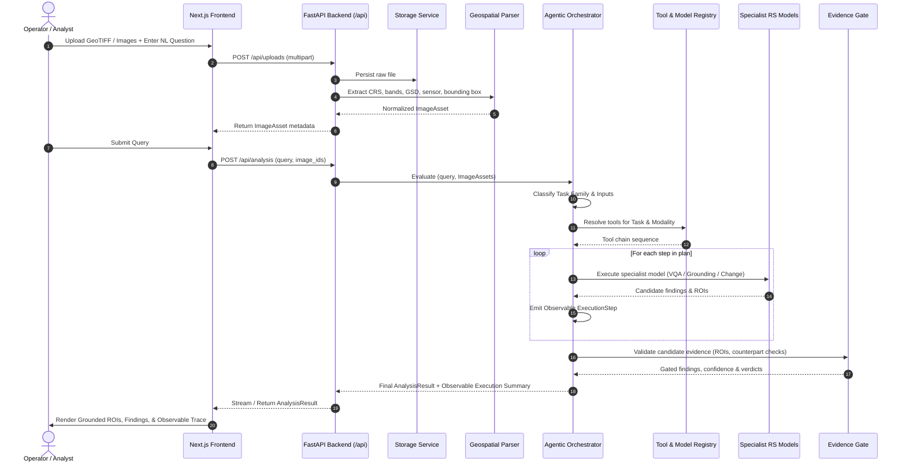

# SatQuery AI — System Architecture
**AI-Powered Satellite Image Analysis System**


---

## 1. System Mission & Core Philosophy

SatQuery AI is an agentic vision-language assistant designed for multi-modal remote sensing imagery (optical, multispectral, and Synthetic Aperture Radar).

### Non-Negotiable Product Rule
**The user never chooses operational modes** such as *Observe*, *Compare*, or *Fuse*. Those are internal orchestrator capabilities. The user workflow is always:
```text
Upload imagery (GeoTIFF / TIFF / approved PNG)
               +
Ask a natural-language question
               ↓
SatQuery automatically interprets intent, validates inputs, selects specialist models,
executes verification, and returns grounded evidence.
```

---

## 2. Target Repository Structure

```text
satquery/
├── app/                        # Next.js 15 UI workspace & landing page
├── components/                 # React UI components (canvas, findings, panels)
├── lib/
│   ├── api/                    # Typed frontend API client layer (NEW)
│   │   ├── client.ts           # Central fetch client with error handling
│   │   ├── uploads.ts          # Upload API client
│   │   ├── analysis.ts         # Analysis & status API client
│   │   └── jobs.ts             # Async job polling client
│   ├── analysis.ts             # Display and evidence transformation utilities
│   ├── domain.ts               # Shared frontend domain interfaces
│   ├── demos.ts                # Isolated demonstration fixtures (curated data)
│   └── validation.ts           # Deterministic evidence gate algorithms
├── backend/                    # Production FastAPI backend (NEW)
│   ├── app/
│   │   ├── main.py             # FastAPI entrypoint, CORS, exception handlers
│   │   ├── api/
│   │   │   └── routes/
│   │   │       ├── health.py   # GET /health
│   │   │       ├── uploads.py  # POST /api/uploads
│   │   │       ├── analysis.py # POST /api/analysis, GET /api/analysis/{id}
│   │   │       └── jobs.py     # GET /api/jobs/{job_id}
│   │   ├── core/
│   │   │   ├── config.py       # Pydantic Settings (ENV configuration)
│   │   │   └── logging.py      # Structured observable logging
│   │   ├── domain/
│   │   │   ├── tasks.py        # TaskFamily & AnalysisStatus enums
│   │   │   └── modalities.py   # Modality & ImageFormat enums
│   │   ├── schemas/
│   │   │   ├── image_asset.py  # ImageAsset metadata schema
│   │   │   ├── analysis.py     # AnalysisRequest & AnalysisResult schemas
│   │   │   ├── execution.py    # ExecutionStep schema (observable only)
│   │   │   └── evidence.py     # BoundingBox, EvidenceItem, Validation schemas
│   │   ├── services/
│   │   │   ├── storage/        # StorageService abstraction & LocalStorage
│   │   │   ├── geospatial/     # GeoTIFF, CRS, metadata parsing (GDAL/Rasterio)
│   │   │   ├── orchestration/  # Query interpretation & task router
│   │   │   ├── models/         # Model execution wrappers (VLM, grounding, SAR)
│   │   │   └── evidence/       # Counterpart verification & evidence gate
│   │   └── registry/
│   │       ├── model_registry.py # Model and specialist tool registry
│   │       └── tool_registry.py  # Tool definitions and task mappings
│   ├── tests/                  # Pytest automated test suite
│   └── requirements.txt        # Backend dependencies
├── docs/
│   ├── CURRENT_STATE_AUDIT.md  # Prototype audit & component classification
│   └── ARCHITECTURE.md         # This target architecture specification
├── public/                     # Static assets & curated mission imagery
└── README.md                   # Setup & development instructions
```

---

## 3. End-to-End Data & Execution Flow



---

## 4. Official Task Families

SatQuery AI structures all remote sensing tasks into six primary task families:

1. **`SINGLE_VQA`**: Visual Question Answering on a single optical, multispectral, or SAR scene.
2. **`SINGLE_GROUNDING`**: Text-guided object or feature detection returning normalized spatial bounding boxes / ROIs.
3. **`SINGLE_CAPTION`**: Descriptive summarization of a single scene's land cover and spatial characteristics.
4. **`TEMPORAL_CHANGE`**: Identifying, localizing, and classifying differences across bi-temporal acquisitions (T₁ and T₂) of the same footprint.
5. **`TEMPORAL_CHANGE_VQA`**: Answering targeted questions regarding what changed between T₁ and T₂, why, and with what spatial evidence.
6. **`OPTICAL_SAR_ANALYSIS`**: Complementary cross-sensor analysis between co-registered optical/multispectral imagery and Synthetic Aperture Radar (SAR) backscatter data.

---

## 5. Remote Sensing Ingestion & GeoTIFF-First Architecture

- **Primary Format**: Cloud-Optimized GeoTIFF (`COG`) / Standard GeoTIFF (`.tif`, `.tiff`).
- **Benchmark Formats**: Standard PNG / JPEG only for approved benchmark dataset evaluations.
- **Normalization Pipeline**:
  - Extract coordinate reference system (CRS via EPSG code or WKT).
  - Extract ground sample distance (GSD / resolution in meters).
  - Determine sensor platform (Sentinel-1, Sentinel-2, Landsat 8/9, Cartosat, RISAT) from metadata tags.
  - Determine modality: `OPTICAL`, `MULTISPECTRAL`, `SAR`, or `UNKNOWN`.
  - Validate raster dimensions, band counts, and nodata masks.

---

## 6. Remote Sensing Model Adaptation Strategy

Generic commercial LLMs/VLMs are insufficient for rigorous earth observation. SatQuery targets genuine fine-tuning / adaptation on domain-specific datasets:
- **Adaptation Dataset**: **BigEarthNet-S2 / BigEarthNet-MM** (multimodal Sentinel-1 + Sentinel-2 benchmark) or equivalent open RS datasets.
- **Specialist Roles**:
  - Pretrained RS visual backbone for multi-spectral patch encoding.
  - Grounding specialist for spatial ROI localization.
  - Change-detection specialist for pixel-difference verification.
- **Fail-Safe Contract**: When a specialist model is absent from the deployment environment, the registry returns `NOT_IMPLEMENTED` or `MODEL_UNAVAILABLE`. No synthetic responses are ever fabricated.

---

## 7. Observable Execution Traces vs. Internal Reasoning

To provide auditability without leaking hidden model reasoning or chain-of-thought:
- **Exposed Fields (`ExecutionStep`)**:
  - `step`: Descriptive name of the execution phase.
  - `tool_name`: The registered specialist tool invoked.
  - `model_name`: The physical model checkpoint or service name.
  - `parameters`: High-level operational arguments (e.g. target bands, threshold).
  - `status`: `pending`, `running`, `completed`, `failed`, `skipped`.
  - `duration_ms`: Real execution duration in milliseconds.
  - `summary`: Observable output summary (e.g. "3 ROIs identified; counterpart check satisfied").
- **Strict Prohibition**: No internal chain-of-thought scratchpads, system prompt secrets, or private reasoning paths are exposed to the client.
